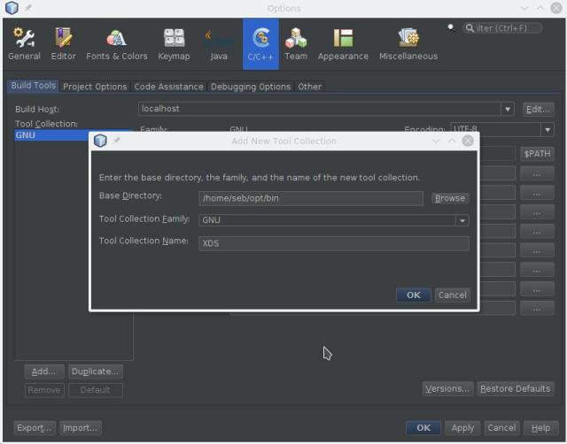
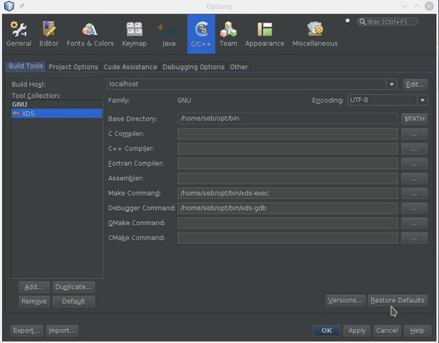

# xds-gdb: wrapper on gdb for XDS

`xds-gdb` is a wrapper on gdb debugger for X(cross) Development System.

This tool allows you to debug an application built with an xds-server without the
need to install gdb or any cross tool.

Two debugging models are supported:

1. XDS remote debugging requiring an XDS server and allowing cross debug your
  application.
1. native debugging

 By default XDS remote debug is used and you need to define `XDS_NATIVE_GDB`
variable to use native gdb debug mode instead.

> **SEE ALSO**: [xds-server](https://github.com/iotbzh/xds-server), a web server
used to remotely cross build applications.  
> **SEE ALSO**: [xds-exec](https://github.com/iotbzh/xds-exec),
wrappers on `exec` command that allows to cross build your application through `xds-server`.

## Getting Started

## Installing xds-gdb

Download latest `xds-gdb` release on [https://github.com/iotbzh/xds-gdb/releases](https://github.com/iotbzh/xds-gdb/releases).

Extract the tarball anywhere you want, for example:

```bash
mkdir -p ~/opt/bin
unzip -j $DOWNLOAD_DIR/xds-gdb_linux-amd64-v1.0.0.zip xds-gdb/xds-gdb ~/opt/bin
```

## Configuration

 `xds-gdb` configuration is defined by variables (see listed below).  
 These variables may be set using :
 
- environment variables (inherited),
- or a config file set with `XDS_CONFIG` environment variable, for example:
  `XDS_CONFIG=/tmp/my_xds_gdb_config.env xds-gdb`
- or by setting variables within a gdb ini file (see details below),
- or a "user" config file located in following directory (first found is taken):
  1. $(CURRENT_DIRECTORY)/.xds-gdb.env
  1. $(CURRENT_DIRECTORY)/../xds-gdb.env
  1. $(CURRENT_DIRECTORY)/target/xds-gdb.env
  1. $(HOME)/.config/xds/xds-gdb.env

### Configuration Variables

 `XDS_CONFIG` :  
 Config file defining `XDS_xxx` configuration variables. Variables of this file
 will overwrite inherited environment variables. Variables definition may be 
 prefixed or not by "export" keyword.  
 Here is an example of 

```bash
cat $HOME/myProject/xds-gdb.env

export XDS_SERVER_URL=http://xds-docker:8000
export XDS_PROJECT_ID=IW7B4EE-DBY4Z74_myProject
export XDS_SDK_ID=poky-agl_aarch64_3.99.1+snapshot
```

`XDS_LOGLEVEL` :  
Set logging level (supported levels: panic, fatal, error, warn, info, debug)

`XDS_LOGFILE` :  
Set logging file, default `/tmp/xds-gdb.log`.

`XDS_NATIVE_GDB` :  
Use native gdb mode instead of remote XDS server mode.

`XDS_PROJECT_ID` : *(mandatory with XDS server mode)*  
Project ID you want to build 
 
`XDS_RPATH` :  
Relative path into project

`XDS_SDK_ID` : *(mandatory with XDS server mode)*  
Cross Sdk ID to use to build project

`XDS_SERVER_URL` :  *(mandatory with XDS server mode)*  
Remote XDS server url

### Configuration variables set within gdb init command file

Above `XDS_xxx` variables may also be defined within gdb init command file 
(see --command or -x option of genuine Gdb).  
You must respect the following syntax: commented line including `:XDS-ENV:` tag

Example of gdb init file where we define project and sdk ID:

```bash
     # :XDS-ENV: XDS_PROJECT_ID=IW7B4EE-DBY4Z74_myProject
     # :XDS-ENV: XDS_SDK_ID=poky-agl_aarch64_3.99.1+snapshot
```

## Using xds-gdb from command line

### XDS remote debugging mode

First the project you want to debug must be declared on an xds-server and this
project may also has been built using this xds-server (see [xds-server](https://github.com/iotbzh/xds-server) for more details).

So to debug it you need to know the xds-server url (eg. <http://xds-docker:8000>),
you also need the project and sdk unique id. You can find these IDs in project 
page of XDS dashboard or you can get them from command line using the `--list` 
option.  
This option lists all existing projects ID:

```bash
XDS_SERVER_URL=http://xds-docker:8000 xds-gdb --list
```

Now to refer your project, just set `XDS_PROJECT_ID` and `XDS_SDK_ID` variables.

You are now ready to use `xds-gdb` to for example cross debug your project.
Here is an example to build and debug a project based on CMakefile and
[AGL app-templates](https://git.automotivelinux.org/apps/app-templates/):

```bash
# Go into your project directory (for example helloworld-service)
git clone https://github.com/iotbzh/helloworld-service.git
cd helloworld-service

# Declare your project on xds-server
# <for now, you can only do this step using xds HTML dashboard (see xds-server doc)>

# Define XDS config
cat <<EOF >./xds-config.env
XDS_SERVER_URL=http://xds-docker:8000
XDS_PROJECT_ID=IW7B4EE-DBY4Z74_myProject
XDS_SDK_ID=poky-agl_aarch64_3.99.1+snapshot
EOF

# Tell to xds-exec and xds-gdb which is your config file 
export XDS_CONFIG=../xds-config.env

# Create a new build directory
mkdir build && cd build

# Start remote cross build
xds-exec -- cmake ..
xds-exec -- make 
xds-exec -- make remote-target-populate

# Start debugging
xds-gdb -x target/gdb-on-root@myTarget.ini
```

> **Notes** : [Helloworld-service project](https://github.com/iotbzh/helloworld-service)
is an AGL project based on app-templates that can be build and debug using XDS.

### Native debugging

To enable native debugging mode, you need to define `XDS_NATIVE_GDB` variable.

## Using xds-gdb within an IDE

### Netbeans

__Netbeans 8.x :__
Open menu Tools -> Options  
Then open C/C++ tab, in "Build Tools" sub-tab, click on "Add" button:


Then, you should set *Debugger Command* to point to xds-gdb



### Others IDE

*Coming soon...*

## How to build xds-gdb from scratch

### Prerequisites

 You must install and setup [Go](https://golang.org/doc/install) version 1.7 or
 higher to compile this tool.

### Building

Clone this repo into your `$GOPATH/src/github.com/iotbzh` and use delivered Makefile:

```bash
 export GOPATH=$(realpath ~/workspace_go)
 mkdir -p $GOPATH/src/github.com/iotbzh
 cd $GOPATH/src/github.com/iotbzh
 git clone https://github.com/iotbzh/xds-gdb.git
 cd xds-gdb
 make
```

## Debug

Visual Studio Code launcher settings can be found into `.vscode/launch.json`.
